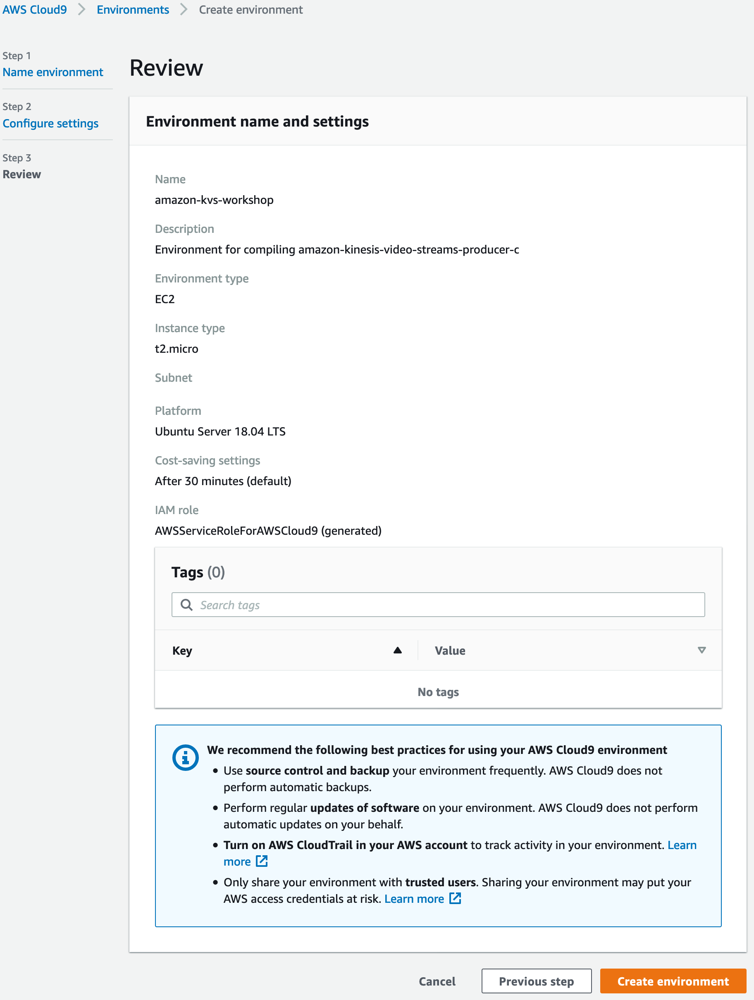

# Lab 0 - Setup the Labs

The following Setup Guide is designed to help you get up and running quickly for the workshop.

For this, we will be using [AWS Cloud9 Development ](https://aws.amazon.com/cloud9/) environment. AWS Cloud9 is a cloud development IDE that we will use to compile and build our Amazon FreeRTOS code.

Once you have setup the environment, you will be able to build and  compile the different labs, you will download the binary compiled  firmware files, and you will flash your device locally on your laptop.

**ProTip:** You can also follow the [Local Setup Guide](https://teuteuguy.github.io/amazon-freertos-workshop-docs/docs/local-setup-guide) to setup the environment for local development.

## Create Cloud9 Environment

Log in to your AWS Account Console and search for Cloud9

Create a New Environment by clicking the **Create Environment** button

Name your environment and provide a description, then press **Next step**

**Warning** If you are running  this workshop within the same account as other people, please make sure  to name your environment with a customized name of your choosing in  order to find your environment. Why not your name?

Now configure your Cloud9 instance:

- For Environment type, choose **Create a new instance for environment (EC2)**
- Choose **t2.micro** for the instance type
- Choose **Ubuntu Linux** for the Platform
- Press **Next step**

- Review and press **Create environment**

## Done

You are done with the IDE setup and are ready to move to [Lab 1]