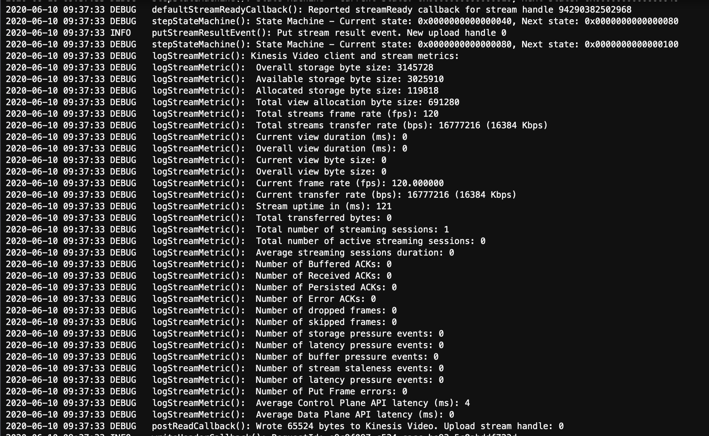
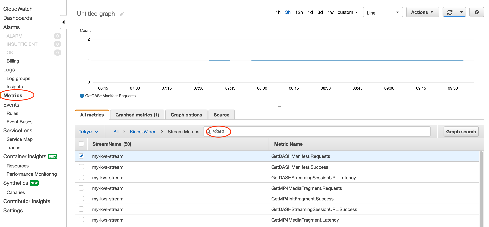

# Debugging in 5 levels

## 1.Log, verbose log!

```
export AWS_KVS_LOG_LEVEL=1
```




## 2.Dump video in mkv format to local

```
export KVS_DEBUG_DUMP_DATA_FILE_DIR=$PWD
```


## 3.Cloudwatch metrics. But *no log, only graphics.*




## 4.CLI: aws kinesisVideo

```
# get reader endpoint
aws kinesisvideo get-data-endpoint --api-name GET_MEDIA_FOR_FRAGMENT_LIST --stream-name my-kvs-name --region us-west-2
# ListFragments
aws kinesis-video-archived-media list-fragments --stream-name my-kvs-name --endpoint https://b-647daf39.kinesisvideo.us-west-2.amazonaws.com --region us-west-2 --fragment-selector "FragmentSelectorType=PRODUCER_TIMESTAMP,TimestampRange={StartTimestamp=1588030831,EndTimestamp=1588031971}"
# GetMediaForFragmentList
aws kinesis-video-archived-media get-media-for-fragment-list --stream-name my-kvs-name --fragments='["91343852333181432595704229070926822931608131393"]' 'out.mkv' --endpoint https://b-647daf39.kinesisvideo.us-west-2.amazonaws.com --region us-west-2
```


## 5.ListFragments API

Returns a list of Fragment objects from the specified stream and timestamp range within the archived data.

Listing fragments is eventually consistent. This means that even if the producer receives an acknowledgment that a fragment is persisted, the result might not be returned immediately from a request to ListFragments. However, results are typically available in less than one second. 

https://docs.aws.amazon.com/kinesisvideostreams/latest/dg/API_reader_ListFragments.html

## Done


You are done with the debugging and are ready to move to [Lab 4]({{ "/lab/lab-4" | absolute_url }})