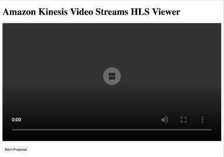

# Make your own HLS player 

## Step 1: Create HTML Page

To get started with HLS playback of a KVS stream, start by creating a skeleton HTML page with the VideoJS player and AWS SDK loaded into it. Copy this code into a file and save it as something like kvs_hls.html
```
<html>
    <head>
        <script src="https://cdnjs.cloudflare.com/ajax/libs/jquery/3.3.1/jquery.slim.min.js"></script>
        <script src="https://cdnjs.cloudflare.com/ajax/libs/aws-sdk/2.278.1/aws-sdk.min.js"></script>
        <title>Amazon Kinesis Video Streams HLS Viewer</title>
    </head>
    <body>
        <h1 style="margin: 20px 0;">Amazon Kinesis Video Streams HLS Viewer</h1>
        <div id="playerContainer" style="margin: 20px 0;">

            <!-- VideoJS elements -->
            <video id="videojs" class="player video-js vjs-default-skin" controls autoplay></video>
            <link rel="stylesheet" href="https://vjs.zencdn.net/6.6.3/video-js.css">
            <script src="https://vjs.zencdn.net/6.6.3/video.js"></script>
            <script src="https://cdnjs.cloudflare.com/ajax/libs/videojs-contrib-hls/5.14.1/videojs-contrib-hls.js"></script>
        </div>
        <button id="start" type="submit" class="btn btn-primary">Start Playback</button>
        <script>
            console.log("Page loaded")
            // Step 2 Goes Here

            
        </script>
        <style>
            #playerContainer, .player { width: 100%; height: auto; min-height: 400px; background-color: black; }
            .vjs-big-play-button { display: none !important; }
        </style>
    </body>
</html>

```

 

Open the HTML file in a web browser (preferably Chrome). You should see a page that looks like this:



If you open the browser console (Option + Command + I on Mac and Control + Shift + I on Windows) you should see the “Page loaded” message.

## Step 2: Configure HLS parameters and SDK Clients

In the HTML where is says “Step 2 Goes Here”, copy in this code:

```
// Step 2: Configure HLS parameters and SDK Clients
var streamName = 'streamName'; // The StreamName
var playbackMode = 'LIVE'; // LIVE or ON_DEMAND
var fragmentSelectorType = 'PRODUCER_TIMESTAMP'; // SERVER_TIMESTAMP or PRODUCER_TIMESTAMP
var startTimestamp = new Date('11/29/2018, 03:00 PM'); // ON_DEMAND mode only
var endTimestamp = new Date('11/29/2018, 03:30 PM'); // ON_DEMAND mode only
var discontinuityMode = 'NEVER'; // ALWAYS or NEVER
var maxMediaPlaylistFragmentResults = 3; // 1-1000 (3 recommended for LIVE, 1000 for ON_DEMAND)
var expires = 3600; // Number of seconds before HLS URL is invalid. Min 300


var options = {
    accessKeyId: 'ACCESS_KEY', // AWS Credentials
    secretAccessKey: 'SECRET_KEY', // AWS Credentials
    region: 'us-west-2'
}
var kinesisVideo = new AWS.KinesisVideo(options);
var kinesisVideoArchivedContent = new AWS.KinesisVideoArchivedMedia(options);

// Step 3 Goes Here
```


This code creates variables for all of the HLS parameters and creates the KVS clients for calling KVS APIs. Replace the sections in red (streamName, ACCESS_KEY, SECRET_KEY) with the correct values and credentials for your stream.

## Step 3: Get a data endpoint for the stream

To use the archived media KVS client, it must be provided the stream’s archived media data-plane endpoint. In the JavaScript code where it says “Step 3 Goes Here”, add this code:

```
$('#start').click(function() { // "Start Playback" button click event listener

    // Step 3: Get a data endpoint for the stream
    console.log('Fetching data endpoint');
        kinesisVideo.getDataEndpoint({
        StreamName: streamName,
        APIName: "GET_HLS_STREAMING_SESSION_URL"
    }, function(err, response) {
    if (err) { return console.error(err); }
    console.log('Data endpoint: ' + response.DataEndpoint);
    kinesisVideoArchivedContent.endpoint = new AWS.Endpoint(response.DataEndpoint);

    // Step 4 Goes Here

		});
});
```

 

If you save, then go back to the browser and refresh the page, the data endpoint will be loaded when the “Start Playback” button is clicked.

## Step 4: Get an HLS Streaming Session URL

The next step is to get an HLS URL to provide to the VideoJS player. Place this code for calling the GetHLSStreamingSessionURL API where it says “Step 4 Goes Here”:

```
// Step 4: Get an HLS Streaming Session URL
console.log('Fetching HLS Streaming Session URL');
kinesisVideoArchivedContent.getHLSStreamingSessionURL({
    StreamName: streamName,
    PlaybackMode: playbackMode,
    HLSFragmentSelector: {
        FragmentSelectorType: $('#fragmentSelectorType').val(),
        TimestampRange: playbackMode === 'LIVE' ? undefined : {
        StartTimestamp: startTimestamp,
        EndTimestamp: endTimestamp
    }
},
DiscontinuityMode: discontinuityMode,
MaxMediaPlaylistFragmentResults: maxMediaPlaylistFragmentResults,
Expires: expires
}, function(err, response) {
if (err) { return console.error(err); }
console.log('HLS Streaming Session URL: ' + response.HLSStreamingSessionURL);

// Step 5 Goes Here
});
```

If you save, then go back to the browser and refresh the page, the HLS URL will be loaded when the “Start Playback” button is clicked.

## Step 5: Give the URL to the video player

This step is unique to VideoJS but is a similar process for any web player that supports HLS. Add this code to start playback of the VideoJS player where it says “Step 5 Goes Here”:

```
// Step 5: Give the URL to the video player.
var playerElement = $('#videojs');
playerElement.show();
var player = videojs('videojs');
console.log('Created VideoJS Player');
player.src({
src: response.HLSStreamingSessionURL,
type: 'application/x-mpegURL'
});
console.log('Set player source');
player.play();
console.log('Starting playback');
```


If you save, then go back to the browser and refresh the page, live video playback should start when the “Start Playback” button is clicked. The producer must still be producing video to the specified stream.

## Step 6: On-Demand playback

In the parameters set in Step 2, change from the playbackMode from “LIVE” to “ON_DEMAND”, set a start and end time of when the producer was producing, and set the maxMediaPlaylistFragmentResults to 1000. Save and refresh the page and a video clip should play instead of live playback.

## HLS KVS Sample Page

There is a more complete sample HLS page available on GitHub here:

https://github.com/aws-samples/amazon-kinesis-video-streams-hls-viewer/blob/master/index.html


## Done


You are done with the HLS player and are ready to move to [Lab 5]({{ "/lab/lab-5" | absolute_url }})